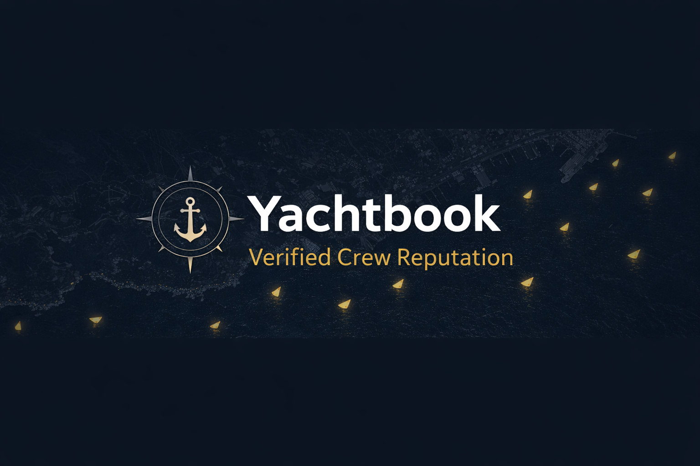
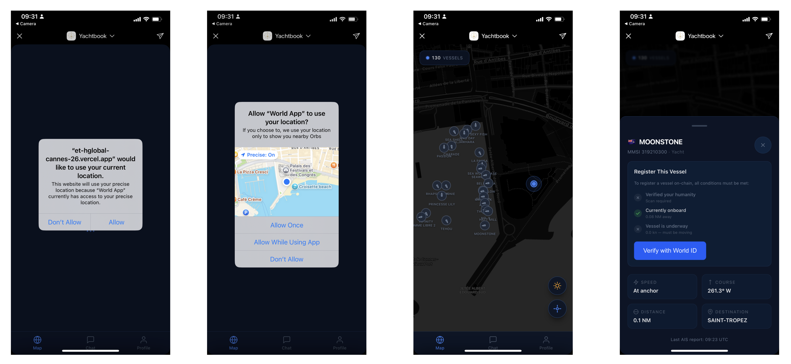

# Yachtbook

**Verified Crew Reputation for the Yachting Industry**

World proves the human. Chainlink proves the boat. Together they create trust you can't fake.

## Live App

Try it on World App: [Launch Yachtbook](https://world.org/mini-app?app_id=app_2440ba47008f55323c2115880a8ee6df&path=&draft_id=meta_454590185b45b4a5099634eadeb78716)

  

## Screenshots

## What it does

Yachtbook is a decentralized trust layer for the $8B+ yacht crewing industry. Crew members verify their identity with World ID, register against real vessels via Chainlink CRE oracles pulling live AIS data, and build portable on-chain reputation through crew attestations.

## How it works

- **World ID 4.0** -- Nullifier as permanent crew identity (not a wallet, not an email)
- **MiniKit 2.0** -- Native Mini App inside World App with GPS co-location and verify commands
- **Chainlink CRE** -- Confidential HTTP workflow: AIS API lookup, GPS co-location check, consensus, signed report, EVM write
- **On-chain contracts** -- YachtRegistry + CrewAttestation on World Chain

## Key features

- Vessel registration with live AIS oracle verification
- Crew attestations tied to World ID nullifiers
- Who's Around map with real-time vessel tracking
- Dual-mode crew profiles (professional / social)
- AI crew agency endpoint with human-backed agent verification

## Presentation

[Slide deck](https://canva.link/6u1wa416ezbb9o3)

## Built at

ETHcc Hackathon 2026
